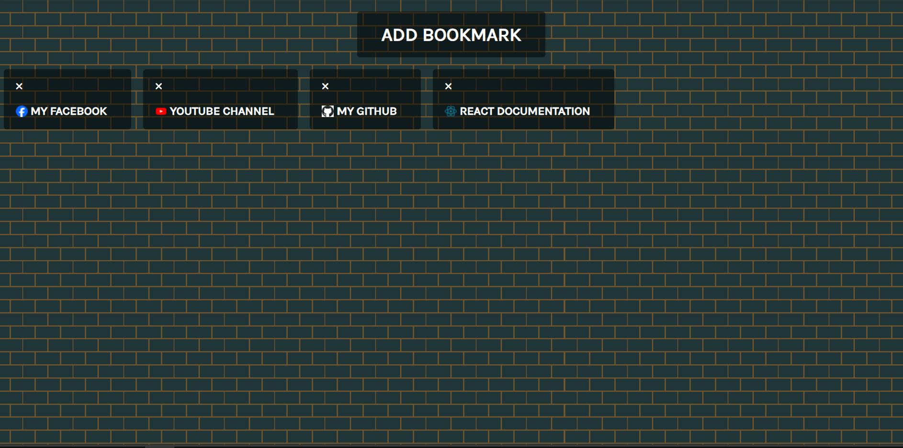
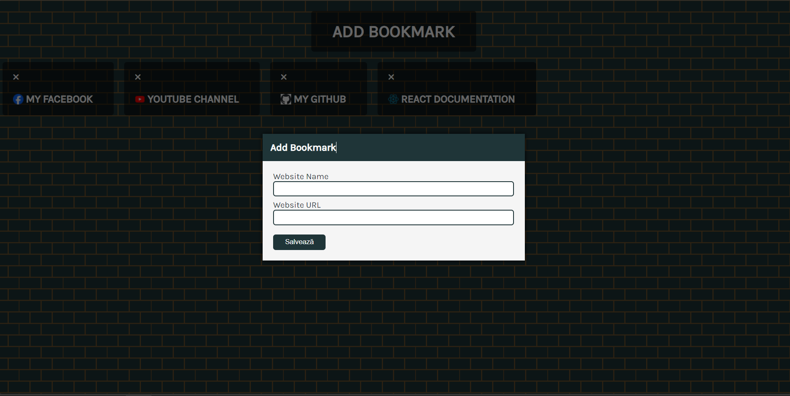

# Bookmark App 🚀

A simple application for managing web page bookmarks. Save your favorite sites and organize them efficiently.

## Screenshots 📷

A representative image of the application interface.

Another view of the application, highlighting its features.

## Live Demo 🌐

Experience the app in action! [Live Demo](https://lambrugeorge.github.io/bookmark-app/)

## Technologies Used 💻

- HTML, CSS for the structure and style of the web page.
- JavaScript for interactive features.
- [Font Awesome](https://fontawesome.com/) for icons.

## How to Use 📝

1. Open the modal by clicking on the "Add Bookmark" button.
2. Enter the name and URL of the site you want to save.
3. Click the "Save" button to add the bookmark.
4. View and manage existing bookmarks in the bookmarks section.

## Special Thanks 🙌

Special thanks to [Jacinto Design](https://github.com/JacintoDesign) for the inspirational "JavaScript Projects" course. This project was developed as part of the course available at [Zero to Mastery](https://zerotomastery.io/courses/javascript-projects/).
